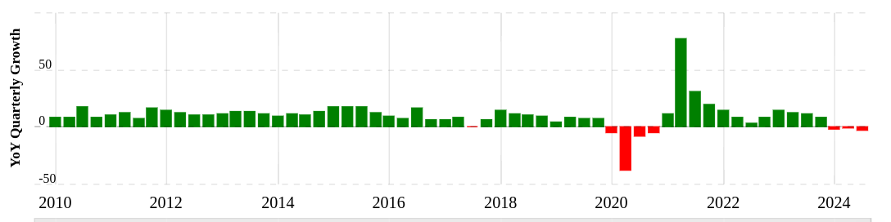
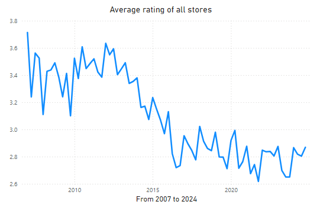
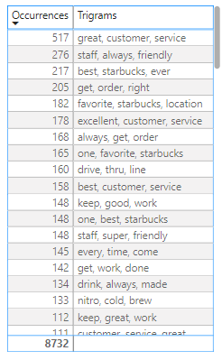
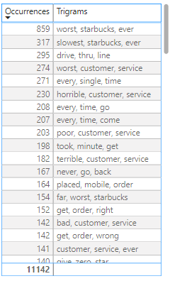
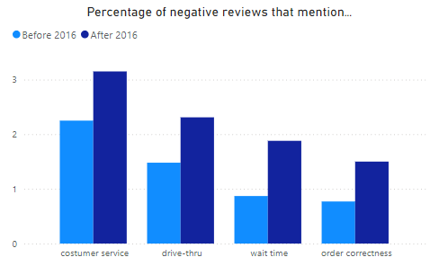
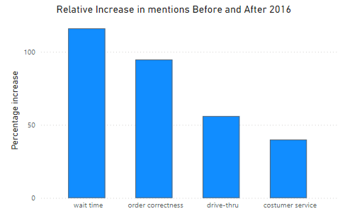
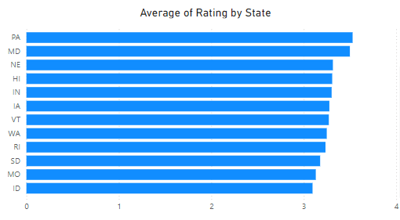
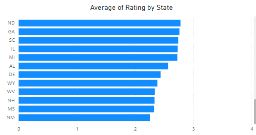

# Analysis of Starbucks 

## Project Intro/Objective

The purpose of this project is to explore possible driving factors of the recent decline in the revenue growth of the international coffee chain Starbucks.
Starbucks revenue for the quarter ending September 30, 2024 was $9.074B, a 3.2% decline year-over-year.

The recent decline in performance is such a concern that guidance for 2025 has been suspended 

## Project Description
This project obtains a real world data set through scraping tens of thousands of Yelp reviews of Starbucks stores across the United States of America and attempts to derive insights and reveal correlations ,if any, between costumer satisfaction with the coffee chain and its recent financial performance by analyzing overall trends in customer satisfaction and using natural language processing to uncover finer details as to what is influencing sentiment.

## Executive Summary
Customer satisfaction with Starbucks stores throughout the U.S. averages 2.95 stars out of 5. Reviews have trended downward across time from an average of 3.36 stars to an average of 2.85 stars with the sharpest decrease between the years 2015 and 2016. Natural language processing of reviews before and after this period of decrease in average review rating show that wait times and incorrect orders are topics that show the highest increase in frequency in negative reviews, 116% more for wait times and 95% more for incorrect orders. Other topics that show an increase are issues with the drive-thru and the new, as of 2019, mobile ordering system. However, further natural language processing reveals that these issues are a subcategories that can be placed under topics of wait times and incorrect orders. We suggest that wait times are decreased by providing adequate staff during peak hours and better prioritizing orders between in-store, drive-through, and movile orders. We also suggest simplifying the menue in order to reduce the frequency of incorrect orders while keeping in mind not to alienate long term customers who come to Starbucks specifically for their complex order. We believe that these measures will also positively influence each other. Adequate staff will ensure that employees are not overwhelmed which may reduce the frequency of incorrect orders and a simplified menu will create a more streamlined  work environment which may reduce wait times.
Further analyis is underway to uncover any differences between stores in our top performing states, Pennsylvania and Maryland, and our bottom performing states, New Mexico, Mississippi, West Virginia, and New Hampshire.

### Methods Used
Over 72,000 reviews were scraped in several steps from Yelp using a costum built scraper built with the selenium and beautifulsoup libraries in python.
The stores are mainly located within each states capital but additional cities were used if review counts in some states where too low in order to gain a more accurate picture.
Included with each review data point is the rating, the state that it is from, and the date of the review.
This data was then loaded into a Postgresql database for storage and light exploratory analysis.
Natural language processing with the nltk (natural language toolkit) python library was used to explore review content and frequency of topics and themes. The reviews were concatenated, cleaned and preprocessed before analysis with the natural language toolkit on several filter contexts. The most useful information which was loaded into the database and used for further analysis was the frequency of trigrams, groups of three consecutive written words. These trigrams were further grouped into a few overarching categories based on similarity.
Using pretrained machine learning models with pythons transformers library, reviews of each category were concatenated and summarized to uncover high level overviews of what specific issues customers experienced with each category.
All of this data was imported into Power BI for visualization and further exploratory analysis.

### Technologies
* Python
* Web Scraping with Selenium and Beautiful soup libraries
* Postgresql database
* PowerBI

## Analysis Deep-dive
Review ratings show a downward trend across time with an average review rating trending from around 3.36 stars to 2.85 stars.

An area of interest is the period of decline around 2015 and so analysis of reviews is focused on comparing content of reviews before and after this period of decline to attempt to uncover what driving factors might be the cause of this decline.
Reviews were filtered based on contexts of bad reviews (1 star reviews) and good reviews (5 star reviews) as well as reviews before 2016 and after 2016.
After concatenating and preprocessing reviews for natural language processing with pythons nltk library, a list of ngrams (consecutive word groups of n words long) were extracted into a list of 100 most frequent ngrams.
Trigrams (ngrams of 3 words long) were found to reveal the most information as well as uncover product level information because many starbucks drink names are exactly 3 words in length.

Many similar trigrams, such as "made drink wrong" and "got order wrong", were placed into a sinlge category and after discarding trigrams that didnt offer useful information it was found that 4 main categories dominated in all filter contexts.

From this graph, one could posit that customer service being the most dominant issue is where the company needs to focus its resources. It's hard to disagree that quality of customer is central to any client facing operation but the goal in this analysis is to uncover any trends across time that may correlate with declines in financial performance.
Comparing the relative increase in frequency in which each category shows up in reviews before and after 2016 tells different and more accurate story.

From this graph we can see that wait times saw the largest increase in negative reviews before and after 2016 followed by order correctness, drive-through, and then lastly costumer service.
This indicates that increased wait times is the largest driver in decline in average review ratings and therefore the area in which starbucks should consider focusing on improving.
Further natural language processing on each individual category with pythons transformers library which enables the use of pretrained machine learning models to summerize text helps to corroborate this statement.
For instance, summerizing blocks of concatenated negative reviews that mention the drive through show that the underlying issues customers encountered were that of long wait times followed by that of incorrect orders.
The same results were found with a category that only shows up from 2019 and onward, a new mobile ordering system, that consistently was linked with long wait times and incorrect orders.

Therefore, we believe that in focusing attention in two main areas, improving wait times and reducing the amount of incorrect orders, we will see the greatest improvement in customer satisfaction.
For improving wait times we suggest further analysis with staffing, scheduling and business activity data to see in what regions and at what times we need to increase staff to meet customer demand.
For reducing the amount of incorrect orders we suggest simplifying the menu to allow for a more streamline environment, while also taking into consideration not to leave out long term customers who choose starbucks for particular drink orders.

## Finding worth further analysis
From this data, further product level analysis could be carried for certain drinks that show up in the trigrams list. For instance, the nitro cold brew is a trigram that appears a lot in positive reviews, and the white chocolate mocchiato is a trigram that appears a lot in negative reviews. If we choose to simplify the menu then product level analysis with review data combined with sales data may reveal further analysis as to what changes should be made.

It is worth noting that average review rating varied across different states.

Comparing data and collecting additional data from stores that show the highest level of customer satisfaction (Pennsylvania and Maryland) to stores that show the lowest level of customer satisfaction (New Mexico, Mississippi, West Virginia, and New Hampshire) may lead to beneficial insights as to any store or regional differences that lead to positive or negative customer experiences.
